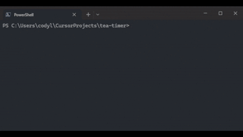

# Tea Timer

[](https://goreportcard.com/report/github.com/Cod-e-Codes/tea-timer)
[](https://github.com/Cod-e-Codes/tea-timer/actions/workflows/go.yml)
[](https://golang.org)
[](https://opensource.org/licenses/MIT)



A minimalist terminal-based countdown timer built with Go and Bubble Tea. Perfect for timing tea steeping, meditation sessions, or any quick countdown needs.

## Features

- **Clean Interface**: Beautiful terminal UI with colored text and smooth animations
- **Visual Feedback**: Spinning animation during countdown, flashing alert when time expires
- **Simple Controls**: Start, pause, reset, and quit with single key presses
- **Flexible Duration**: Set custom countdown time via command line argument
- **Cross-Platform**: Works on Windows, macOS, and Linux

## Quick Start

### Download Pre-built Binaries (v1.0.0)

Download the latest release binaries from [GitHub Releases](https://github.com/Cod-e-Codes/tea-timer/releases/tag/v1.0.0):

- **Linux**: `tea-timer-linux-amd64`
- **Windows**: `tea-timer-windows-amd64.exe`
- **macOS**: `tea-timer-darwin-amd64`

Make the binary executable (Linux/macOS):
```bash
chmod +x tea-timer-linux-amd64
```

Run the timer:
```bash
# Default 60-second timer
./tea-timer-linux-amd64

# Custom duration (120 seconds)
./tea-timer-linux-amd64 120
```

### Build from Source

```bash
# Run with default 60-second timer
go run main.go

# Run with custom duration (in seconds)
go run main.go 120

# Build and run the executable
go build
./tea-timer 300
```

## Controls

- `s` or `space` - Start/pause timer
- `r` - Reset timer to initial duration
- `q`, `ctrl+c`, or `esc` - Quit the application

When the timer finishes, the display will flash to alert you. Press `s` or `space` to restart the timer.

## Requirements

- Go 1.24 or later (for building from source)
- Terminal with color support

## Installation

### From Pre-built Binaries
1. Download the appropriate binary for your platform from [GitHub Releases](https://github.com/Cod-e-Codes/tea-timer/releases/tag/v1.0.0)
2. Make executable (Linux/macOS): `chmod +x tea-timer-*`
3. Run: `./tea-timer-* [duration]`

### From Source
1. Clone the repository
2. Run `go mod tidy` to install dependencies
3. Build with `go build` or run directly with `go run main.go`

## Documentation

- [Contributing Guidelines](CONTRIBUTING.md) - How to contribute to Tea Timer
- [Security Policy](SECURITY.md) - How to report security vulnerabilities
- [Issue Templates](.github/ISSUE_TEMPLATE/) - Templates for bug reports and feature requests

## Project Structure

```
tea-timer/
├── main.go                    # Main application code
├── go.mod                     # Go module file
├── go.sum                     # Dependency checksums
├── README.md                  # Project documentation
├── CONTRIBUTING.md            # Contribution guidelines
├── SECURITY.md                # Security policy
├── LICENSE                    # MIT License
├── .github/
│   ├── workflows/
│   │   └── go.yml            # CI/CD workflow
│   ├── ISSUE_TEMPLATE/       # Issue templates
│   └── pull_request_template.md
└── tea-timer-*-amd64*        # Release binaries
```

## Dependencies

- [Bubble Tea](https://github.com/charmbracelet/bubbletea) - Terminal UI framework
- [Bubbles](https://github.com/charmbracelet/bubbles) - UI components
- [Lip Gloss](https://github.com/charmbracelet/lipgloss) - Terminal styling 
